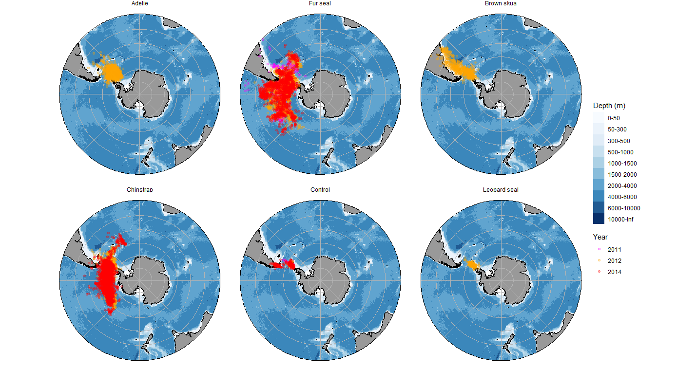

# amlr-gls

The repo contains simple functions and raw data to support analysis of US AMLR data sets from the deployment of light-based geolocators (GLS) on seabird and pinnipeds during the austral winters of 2011, 2012, and 2014. These data are permanently archived at [NCEI Accession 0314795](https://www.ncei.noaa.gov/archive/accession/0314795) and should be cited as:

Hinke J, Krause D, Woodman S (2026) Daily location estimates of Antarctic pinnipeds and seabirds tracked with light-based geolocation (GLS) tags during the austral winters of 2011, 2012, and 2014 (NCEI Accession 0314795). [indicate subset used]. NOAA National Centers for Environmental Information. Unpublished Dataset. <https://www.ncei.noaa.gov/archive/accession/0314795>. Accessed [date].

The `plot_kde_fig` and `plot_raw_data` functions create basic data displays from available data. The former reproduces a version of Figure 1 in Polito et al. [In review]. The latter function maps the entire data set by species and is shown below. The figures from both functions are housed in the [plots](plots) folder for reference.

Old functions in the [old-scripts](old-scripts) folder, including `process_TFgls`, `bias_estimation` and their associated helper functions, were used to process and estimate usable location estimates from raw tag downloads. These old functions are 1) neither intended nor required for use with the current data set, 2) have not been tested for full functionality, and 3) are provided as reference material only. They may have dependency on deprecated R packages.

# Useful references

[Hinke JT, MJ Polito, ME Goebel, S Jarvis, CS Reiss, SR Thorrold, WZ Trivelpiece, GM Watters. 2015. Spatial and isotopic niche partitioning during winter in chinstrap and Adélie penguins from the South Shetland Islands. Ecosphere. 6:art125](http://doi.wiley.com/10.1890/ES14-00287.1)

Polito MJ, Lamb KJ, Hinke JT. A winter’s tail: Feather amino acid isotopes quantify the non-breeding trophic niches of two Antarctic penguins. Biology Letters. _In review_

## Disclaimer

This repository is a scientific product and is not official communication of the National Oceanic and Atmospheric Administration, or the United States Department of Commerce. All NOAA GitHub project code is provided on an ‘as is’ basis and the user assumes responsibility for its use. Any claims against the Department of Commerce or Department of Commerce bureaus stemming from the use of this GitHub project will be governed by all applicable Federal law. Any reference to specific commercial products, processes, or services by service mark, trademark, manufacturer, or otherwise, does not constitute or imply their endorsement, recommendation or favoring by the Department of Commerce. The Department of Commerce seal and logo, or the seal and logo of a DOC bureau, shall not be used in any manner to imply endorsement of any commercial product or activity by DOC or the United States Government.
